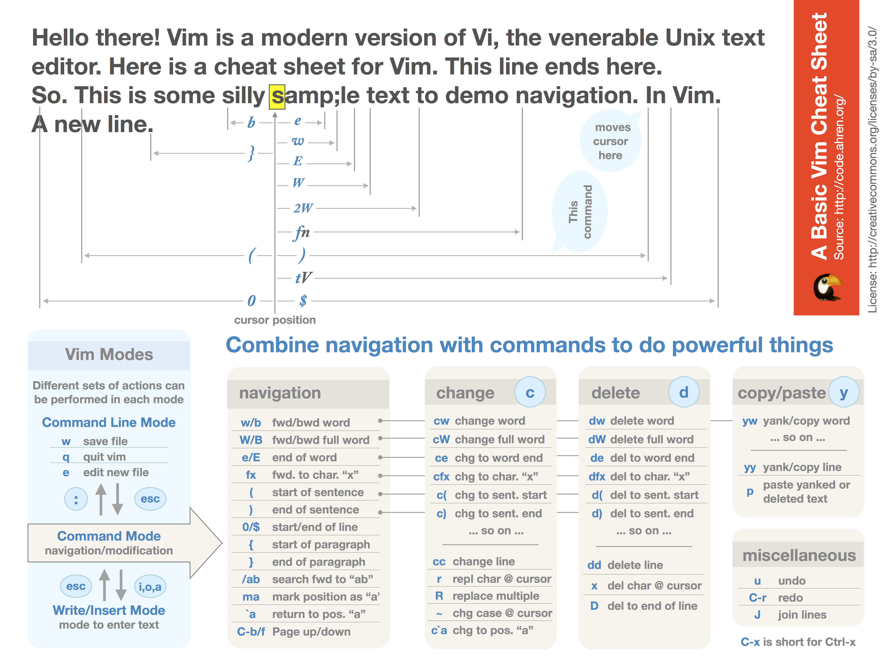

VIM学习教程 
======

## 参考

* [vim中文社区](https://www.osvim.com)
* [MacVim最新版](https://github.com/macvim-dev/macvim/releases)

> 
> 部分图片来源于www.viemu.com,感谢作者🙏

---

## netrw使用说明

按键	说明
F1	帮助
Enter	进入该目录或读取该文件
i	在瘦、长、宽和树形方式切换，来展示文件列表
d	新建目录
%	新建文件
D	删除的文件/目录
r	反向排序列表
R	重命名指定的文件/目录
s	选择排序方式：按名字，时间或文件大小
S	自定义排序
t	在新标签页打开文件/目录
u	跳到之前访问过的目录
U	跳到之后访问过的目录
v	在一个新窗口打开文件/目录，水平分割
o	在一个新窗口打开文件/目录，垂直分割
x	使用关联程序打开文件

用于快速打开非文本型文件，如 word、图片
X	执行文件通过system()
p	预览文件
P	在之前的窗口前预览文件
C-h	输入关键字，隐藏文件名相关的文件
C-l	刷新 netrw 目录列表
-	浏览上一级目录
qf	显示文件信息
cd	使浏览目录为当前目录
mb	添加当前目录到书签
mB	取消当前目录作为书签
gb	跳转到书签目录（3gb跳转到第3个书签）
qb	列出书签目录和历史目录
gh	快速隐藏/取消隐藏.开头的文件或目录，如.vim
gn	进入光标所在目录
mt	当前浏览的目录作为目标文件夹
Tb	当书签目录作为目标文件夹

3Tb 表示第三个书签作为目标文件夹
Th	当历史目录作为目标文件夹

3Th 表示第三个历史目录作为目标文件夹
mc	复制标记文件到目标文件夹
md	对比标记的文件（最多3个）
me	将标记的文件放入 arglist 并对其进行编辑
mf	标记该文件
mF	取消该文件标记
mg	对标记的文件按内容进行vimgrep检索
mm	移动标记的文件到目标文件夹
mp	打印标记文件（打印机的打印）
mr	使用 shell 风格的regexp标记文件
mT	应用的 ctags 标记文件
ma	将标记文件放入 arglist
mA	将 arglist 中的文件作为标记文件
cb	将标记文件放入 buffer-list
cB	将 buffer-list 中的文件作为标记文件
mu	取消所有标记的文件
mv	标记文件应用任意Vim命令
mx	标记文件应用任意shell命令
mX	标记文件整块应用任意shell命令
mz	压缩/解压缩的文件标记
gd	把远程的符号链接作为目录
gf	把远程的符号链接作为文件
C	设置编辑窗口
O	获得由光标指定的文件（远程文件）
C-r	使用gvim服务器浏览
qF	使用quickfix列出标记文件
qL	使用location-list标记文件
mh	显示/隐藏 当前目录的标记文件
a	显示/隐藏文件

---
